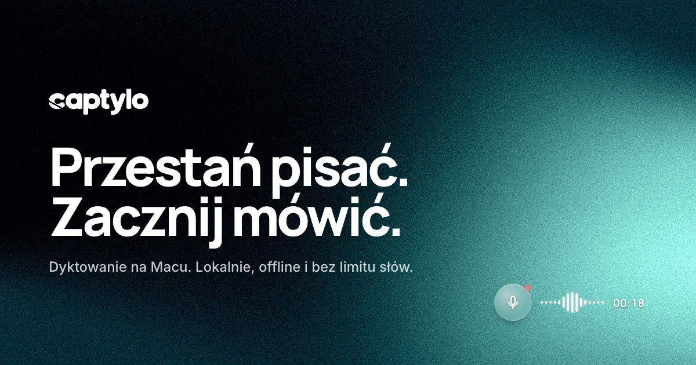

# Captylo

**Mów, a tekst pojawia się tam, gdzie piszesz.** Speak, and the text appears wherever you type.

Captylo is a minimalist, open source dictation app for macOS. Hold a hotkey, speak, let go: the text is pasted at the cursor in any app. Polish first, English and 23 other European languages too. Website: [captylo.com](https://captylo.com).



## Features

- One hotkey, two ways to use it: a short tap starts and stops dictation, holding it records push-to-talk (default Right Option, Fn, Right Command or a custom combo).
- Local transcription with Parakeet TDT 0.6b v3 (FluidAudio), with a live preview in a small floating widget.
- Optional cloud transcription; if the cloud fails, Captylo falls back to the local model.
- Optional AI modes (cleanup, email, to-do list, English, your own) with a hard time limit.
- Learns from your corrections: fix a word once and Captylo remembers it, on your Mac.
- Dictionary: vocabulary hints and replacement rules for names and terms.
- History with audio playback, search and CSV export; dashboard with words, sessions and time saved.
- File transcription: drop an audio or video file or use "Otwórz za pomocą" in Finder.
- Meeting notes: records the call (mic + system audio, no bot) and transcribes it live on your Mac (⌃⌥⌘M starts and ends it); in Pro: a more accurate cloud transcript, AI fixes of misheard words (the original can be restored), speaker labels and AI notes.
- Menu bar menu, Polish UI with English translations.

## Requirements

- macOS 14.4 or later
- Apple Silicon (M1 or newer)
- Microphone and Accessibility permissions (for the global hotkey and pasting)
- For meeting notes: the "System Audio Recording Only" permission (asked the first time a meeting records)

## Build it yourself

A signed download is coming to [captylo.com](https://captylo.com). Until then you can build Captylo from this repository. You need a Mac with Apple Silicon and **Xcode 26** (free from the Mac App Store, about 10 GB, install it first and open it once to accept the licence).

### The easy way: let an AI agent do it

You do not need to be a developer. Open the **Terminal** app, install [Claude Code](https://claude.com/claude-code) (or use Codex, Cursor or any coding agent you like), start it in your home folder and paste this:

```text
Build and install the Captylo dictation app for me from https://github.com/dawidkawalec/captylo.
1. Check that full Xcode 26 is installed (not just the Command Line Tools) and selected with xcode-select. If it is missing, stop and tell me to install it from the Mac App Store.
2. Install Homebrew if it is missing, then `brew install xcodegen`.
3. Clone the repository into ~/captylo and run `make install` there (it builds a Release version and copies Captylo.app to /Applications).
4. Open /Applications/Captylo.app and walk me through granting the Microphone and Accessibility permissions in System Settings.
If a step fails, read the error, fix it and try again. Explain what you do in simple words.
```

The first launch downloads the speech model (about 600 MB) once. After that dictation works offline.

### The manual way

```bash
brew install xcodegen
git clone https://github.com/dawidkawalec/captylo.git
cd captylo
make install   # Release build, copied to ~/Downloads and /Applications
```

Other targets:

```bash
make gen      # generate Captylo.xcodeproj from project.yml
make build    # Debug build into .local-build/
make test     # unit tests
make release  # Release build, copied to ~/Downloads/Captylo.app
make run      # launch the last build
make check    # permissions, model and paths as JSON
```

Self-built copies are signed ad hoc, so macOS may forget the Microphone and Accessibility permissions after you rebuild. Run `make reset-tcc` and grant them again, or run `scripts/setup-signing.sh` once to create a local signing identity that keeps them across builds.

## Privacy

Transcription runs locally on your Mac by default: recordings and text never leave it. The cloud features are optional and off until you turn them on: cloud transcription receives the recording, the AI modes receive the transcript. API keys are stored in the macOS login Keychain. The code is open, so you can check all of this yourself.

Learning from your corrections ("Ucz się z moich poprawek", Settings) stays on your Mac too: after a paste Captylo reads back only that text field for a short while, never password fields, password managers or terminals, and keeps what it learned in `learning.json` next to the dictionary. With an AI mode on, a few before/after pairs go to the same AI to update your style description. Every lesson can be undone in Słownik, and the switch turns it all off.

Meetings are recorded and transcribed on your Mac as well; the audio files can be deleted automatically (Settings > Spotkania) while transcripts and notes stay. Three optional Pro features send meeting data: the cloud transcript sends the meeting audio to the same cloud as cloud transcription, and the AI fixes and AI notes send the transcript to the AI you picked for meetings. The cloud transcript and the AI fixes are off until you turn them on in Settings. Meeting detection only checks which apps use the microphone and, for browsers, whether a window title names a call service; it stores nothing and never records without asking.

## Pricing

- **Free**: unlimited local dictation, forever. Cloud transcription and AI modes work in Free too when you paste your own API keys in Settings (Modele); you pay the provider directly.
- **Pro** (the only paid plan): cloud transcription and AI modes that work right away, with no keys to set up, plus every future feature. Launch prices: [captylo.com](https://captylo.com/#cennik).

## Contributing

Issues and pull requests are welcome. Start with [AGENTS.md](AGENTS.md): it is the source of truth for the architecture, the rules and the commands, for people and coding agents alike. Deeper notes live in [docs/](docs/). A change is done when `make build` and `make test` pass.

## Licence

Captylo is free software under the [GNU General Public License v3.0](LICENSE): you may use, study, change and share it, and anything you distribute that is built on it must stay under the GPLv3 with its source available.

The licence covers the code. The **Captylo name, logo and app icon** are not licensed for other products: if you publish a fork, please give it its own name and icon.

The animated grain gradient is a separately licensed shader (React Bits "Grainient", MIT + Commons Clause), included under an additional permission (GPLv3 section 7). [NOTICE.md](NOTICE.md) has the details and the other third-party components with their licences.

Made by [Dawid Kawalec](https://kawalec.pl).
