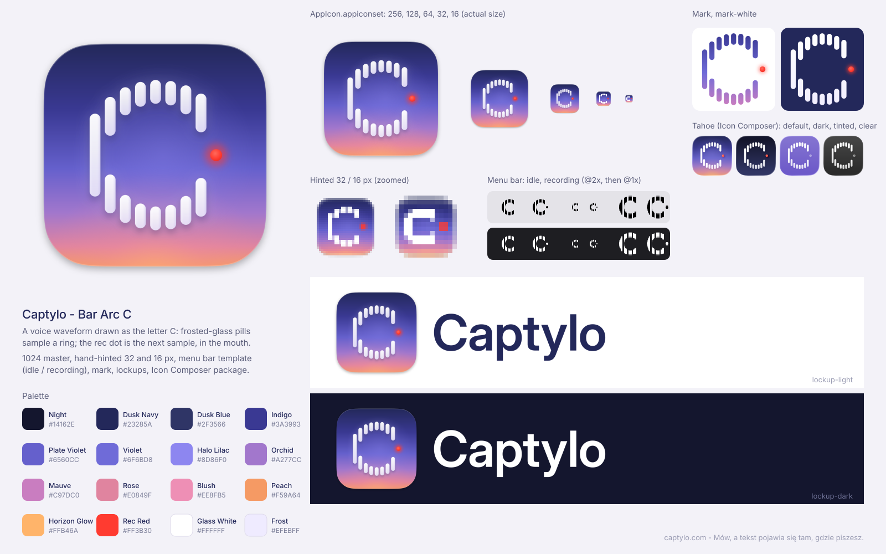

# Captylo - brand assets

> **Current identity: [Brand Direction 01](direction-01/README.md)** (the heavy round C with the
> wider diagonal cut, variant B; Deep Tide palette: Abyss #10272C, Petrol #214A52, Glacier #9FE6DC,
> Fog #B7CCCB, Salt #F2F7F4, Record #F27878, accent Tide #2F8F88; Manrope + Inter). The app icon,
> menu bar glyphs, sidebar wordmark and onboarding mark come from `direction-01/`. Website and
> other materials keep the app's ~10 % darkening over the gradient. The "Bar Arc C" kit below,
> `palette.json` and the `AppIcon.icon` package are the previous identity, kept for reference.

Final identity for **Captylo** (formerly VocaType 2), the minimalist macOS dictation app: hold a hotkey, speak, and the text appears at the cursor. Transcription runs locally on the device. Website: captylo.com. Tagline: *Mów, a tekst pojawia się tam, gdzie piszesz.*



## Concept: Bar Arc C

The mark is a **voice waveform drawn as the letter C**. The widget's **red rec dot** waits in the mouth of the C.

- **Frosted-glass pills sample a ring.** Eight vertical pills on a fixed pitch cut through a ring, exactly like the waveform in the floating widget. The first pill misses the counter, so it is one tall pill: the spine of the C and the loudest sample. Every other column cuts the ring twice. Its outer ends ride the outer circle and its inner ends ride the inner circle, so the silhouette is a true round C made of waveform samples.
- **The red dot (#FF3B30)** is the next position on the same pitch: the next, silent sample of the waveform, and the cursor where your text is about to appear. It sits on the C's horizontal axis, cradled between the two terminals, the way the dot sat in the notch of the old V. It never sits in a corner, so it never looks like a notification badge.
- **The dusk plate is unchanged** from VocaType 2: deep night navy, then indigo and violet, ending in a warm peach horizon glow. Existing users see the same app with a new name.

### How the judges' notes were applied

| Judge note on the "bar-arc" concept | Resolution |
|---|---|
| The back of the C was squared: a short outer bar next to a tall spine read as "(\|" or a bracket | The double spine is gone. There is one full-height spine, the tallest pill. Every pill's outer end sits on one circle, so the back is round. |
| The rows read as separate dotted lines; tighten the aperture | Eight thinner pills (40 wide, 56 pitch) replace six fat ones. The arms read as a continuous stroke, not as rows of teeth. The two terminal columns reach 8 and 18 units further in, which closes the aperture slightly. |
| Bar heights should follow a clean envelope | Lengths come straight from the ring geometry: spine 306, then 144, 104, 92, 88, 90, 107, 143. The profile is smooth and symmetric, with no outlier bar. |
| The dot floats and is not tied to anything; the group leans right | The dot is the ninth sample on the pitch, on the C's horizontal axis, one pill wide (plus 4 units of optical compensation). The whole group is centred: bounding box x 270-760, so its centre is 515 on a 1024 canvas. |
| At 32 px the mark becomes a "[" bracket plus separate 2 px dots | `icon-32.svg` is re-hinted. Five 2 px pills sit on whole pixels, and the 1 px gaps between arm pills are bridged at 50% white. The arms read as one continuous arc with waveform notches. |
| The 16 px icon must stay a C | `icon-16.svg` is a pixel-drawn solid C with hand-set anti-aliasing, plus a 2x2 red dot in the mouth, in the same position as in the master. |
| The menu bar glyph read as "[:" or a loading spinner, sat 1.5 px off centre, and should be built around a solid C | The glyph is redrawn as a solid C annulus sliced into four vertical stripes. The outer contour is a true circle, so it reads as a round C at 18 pt, and the slits keep the waveform. Every stripe is 2 px wide at @1x. The dot appears only in the recording variant. |
| Chat-bubble, spinner and 3D-letter directions | Rejected, as the judges advised. The kit grafts two ideas from the runners-up: the recording state lives only in the recording glyph (bubble-c), and the dot is part of the letter's construction (stroke-c). |

## Construction

- **Canvas**: 1024 x 1024. The body is **824 x 824 at (100, 100)**, the standard macOS grid.
- **Shape**: a continuous-corner squircle with corner radius **185.4** and **60% corner smoothing** (not a plain `rx`). The path is inlined in every SVG.
- **Shadow**: black at 30%, offset y 10, blur 14, drawn as a separate element that stays inside the canvas margins.
- **Ring**: centre (522, 512), outer radius 278, inner radius 190. Pills are 40 wide on a 56 pitch, fully rounded. Terminal curl: the last two columns reach 8 and 18 units further inward.

  | column | x | top pill (y, height) | bottom pill (y, height) |
  |---|---|---|---|
  | 1 (spine) | 270 | 358.8, 306.3 (one pill) | |
  | 2 | 326 | 296.8, 143.6 | 583.6, 143.6 |
  | 3 | 382 | 261.2, 103.5 | 659.3, 103.5 |
  | 4 | 438 | 241.5, 91.6 | 690.9, 91.6 |
  | 5 | 494 | 234.1, 88.1 | 701.8, 88.1 |
  | 6 | 550 | 238.2, 90.0 | 695.8, 90.0 |
  | 7 | 606 | 254.2, 106.8 | 663.0, 106.8 |
  | 8 | 662 | 284.7, 142.9 | 596.5, 142.9 |

- **Rec dot**: centre (738, 512), r 22, with a glow of r 40 blurred by 14.
- **Material**: the pills are ~88-97% white frosted glass, with a Liquid Glass specular rim (brightest top-left and bottom-right), a faint lilac edge shade, a dusk-coloured drop shadow and a soft bloom. This is the same material as VocaType 2.
- **Rendering note**: every filter uses `color-interpolation-filters="sRGB"`, and the plate gradient never passes through a filter. librsvg filters in 8-bit linearRGB by default, and that visibly bands dark gradients.
- **Source of truth**: all geometry is generated by `brand.py` (see "Regenerating" below), so the master, mark, lockups and Icon Composer layers cannot drift apart.

## Palette

**No colour changed.** Every colour, gradient and semantic token is identical to VocaType 2, so the app UI, widget and website need no colour updates. Only the role texts in `palette.json` were updated for the new mark, and it now carries a `changes` entry.

| Name | Hex | Role |
|---|---|---|
| Night | `#14162E` | Darkest surface, dark-mode backgrounds, dark lockup backdrop |
| Dusk Navy | `#23285A` | Top of the plate; wordmark on light (13.8:1 on white) |
| Dusk Blue | `#2F3566` | Secondary dark surface, dark UI cards |
| Indigo | `#3A3993` | Plate 30% stop, top of the mark ink |
| Plate Violet | `#6560CC` | Plate 56% stop |
| Violet | `#6F6BD8` | **Primary accent** (UI accents, focus, links, selection). 4.4:1 on white, so use it for large text or UI elements only. |
| Halo Lilac | `#8D86F0` | Halo that fills the C's counter, hover glows |
| Orchid | `#A277CC` | Plate 76% stop |
| Mauve | `#C97DC0` | Bottom of the mark ink gradient |
| Rose | `#E0849F` | Plate 91% stop |
| Blush | `#EE8FB5` | Wallpaper pink, marketing gradients only |
| Peach | `#F59A64` | Plate bottom, the warm horizon |
| Horizon Glow | `#FFB46A` | Radial sunset glow at the plate's bottom edge |
| Rec Red | `#FF3B30` | Recording dot only (= Apple systemRed) |
| Glass White | `#FFFFFF` | Pills, glyphs, wordmark on dark |
| Frost | `#EFEBFF` | Lower tint of the glass pills, frosted panels |

Machine-readable version with gradients and semantic tokens: [`palette.json`](palette.json).

**Dusk plate gradient** (top -> bottom): `#23285A 0%`, `#3A3993 30%`, `#6560CC 56%`, `#A277CC 76%`, `#E0849F 91%`, `#F59A64 100%`, plus a radial Horizon Glow at the bottom centre.

## Typography

- **Wordmark "Captylo"**: Inter Display SemiBold (Inter variable, `opsz` 32, `wght` 600, SIL OFL 1.1), tracking -1.2%, HarfBuzz shaping and kerning. It is **converted to outlines** with fontTools in both lockup SVGs, so it renders identically on any machine without fonts installed.
  - The round, geometric C of Inter Display echoes the round C of the mark. The single-storey "a", the open "p/y" and the plain "t" keep the name calm and readable at small sizes.
  - Why not SF Pro Display: it is not installed as a named font here, and Apple's licence limits SF to UI mockups for Apple platforms, which rules out a logo.
  - For live text: `font-family: "Inter Display", "Inter", "SF Pro Display", -apple-system, sans-serif; font-weight: 600; letter-spacing: -0.012em`.
- **In the app UI**: the system font, `"SF Pro Display", -apple-system, "Helvetica Neue", Arial`.
- **Lockup geometry**: the icon is `icon.svg` at 0.3125 scale (320 px canvas, 257.5 px body). Cap height is 116.4 px, 45% of the body, and the caps are centred on the body. The gap from the body to the C is 56 px, and the right padding equals the icon's own margin (31.25 px). The lockups are 927 x 320.

## Usage rules

1. **Clear space** around the icon and the lockup is at least **25% of the icon body height**. Nothing else may enter that area.
2. **Minimum sizes**:
   - App icon: at 16 px use `icon-16.svg`, at 32 px use `icon-32.svg`, and at 64 px and above use `icon.svg`.
   - Mark: at least 24 px tall. Below that, use the menu bar glyph.
   - Lockup: at least 120 px wide on screen.
3. **Backgrounds**:
   - `lockup-light` and `mark.svg`: white, Frost or light grey.
   - `lockup-dark` and `mark-white.svg`: Night, Dusk Navy, Dusk Blue, the sunset wallpaper, or dark photography.
4. **The red dot is sacred.** It is always #FF3B30, always in the mouth of the C on its horizontal axis, and always one pill wide. Never recolour it, never remove it from the app icon or the mark, and never use it as a decorative bullet elsewhere.
5. **The menu bar dot appears only while recording.** The idle glyph has an empty mouth, so it never competes with the orange macOS microphone privacy indicator.
6. Don't:
   - recolour the pills (white on the plate, mark ink on light surfaces)
   - change the number, spacing or lengths of the pills, or rotate them. They are always vertical, like the widget waveform.
   - add scenery or photos to the plate
   - stretch, rotate or skew the mark
   - put the icon in another container
   - set the wordmark in a different font or tracking
7. **Menu bar**: use `MenuBarIcon` as a template image (`NSImage(named: "MenuBarIcon")`; the catalog already marks it as a template). Switch to `MenuBarIconRecording` while recording. To show a red dot there, draw a #FF3B30 dot over the template at x 15-17 pt, y 8-10 pt (18 pt canvas) instead of shipping a coloured, non-template image.

## File index

```
branding/
  README.md                      this file
  palette.json                   named colours, gradients, semantic tokens (unchanged values, see "changes")
  overview.png                   one-page brand board
  tahoe-check.png                icons as rendered by macOS 26.5.2 (appiconset, .icon, jailed control)
  logo/
    icon.svg                     master app icon (1024, used for 64 px and up)
    icon-32.svg                  hand-hinted master for 32 px renders
    icon-16.svg                  hand-drawn master for the 16 px render
    mark.svg                     symbol alone, mark ink, for light backgrounds
    mark-white.svg               symbol alone, Glass White, for dark/photo backgrounds
    menubar.svg                  template glyph, idle (black on transparent, 36x36 viewBox)
    menubar-recording.svg        template glyph, recording (dot in the mouth)
    lockup-light.svg             icon + wordmark, Dusk Navy text (light backgrounds)
    lockup-dark.svg              icon + wordmark, white text (dark backgrounds)
    png/
      icon-1024/512/256/128/64.png, icon-32.png, icon-16.png
      mark.png, mark-white.png                           (1200 x 1200)
      menubar.png, menubar@2x.png, menubar-recording.png, menubar-recording@2x.png
      lockup-light.png, lockup-light@2x.png, lockup-dark.png, lockup-dark@2x.png   (927 x 320, 1854 x 640)
  AppIcon.appiconset/            10 PNGs (16 ... 512@2x) + Contents.json   <- drop into Assets.xcassets
  MenuBarIcon.imageset/          menubar.png (18) + @2x (36), template     <- drop into Assets.xcassets
  MenuBarIconRecording.imageset/ recording variant, template
  AppIcon.icon/                  Icon Composer package (Tahoe Liquid Glass, optional, see below)
  site/
    favicon-32.png               from icon-32.svg (hinted)
    favicon-64.png               from icon.svg
    apple-touch-icon-180.png     full-bleed square plate (iOS applies its own mask), opaque
    icon-256.png                 from icon.svg, transparent margins
    og-mark.png                  512 x 512, the icon on a Night/Dusk Blue radial backdrop, opaque
    lockup-dark.svg, mark-white.svg   copies for the website header / footer
```

Sources for `AppIcon.appiconset`: `icon_16x16` comes from `icon-16.svg`; `icon_16x16@2x` and `icon_32x32` come from `icon-32.svg`; every other size comes from `icon.svg`.

Suggested `<head>` for captylo.com:

```html
<link rel="icon" type="image/png" sizes="32x32" href="/favicon-32.png">
<link rel="icon" type="image/png" sizes="64x64" href="/favicon-64.png">
<link rel="apple-touch-icon" href="/apple-touch-icon-180.png">
<meta property="og:image" content="https://captylo.com/og-mark.png">
```

### Regenerating

The current kit is generated by [`direction-01/brand.py`](direction-01/brand.py) (geometry, SVGs, PNG exports, AppIcon set, boards; run it with `uv run --with numpy --with skia-pathops python brand.py`). For a one-off re-render with only `rsvg-convert`:

```bash
cd branding
rsvg-convert -w 16 -h 16 logo/icon-16.svg -o AppIcon.appiconset/icon_16x16.png
rsvg-convert -w 32 -h 32 logo/icon-32.svg -o AppIcon.appiconset/icon_16x16@2x.png
rsvg-convert -w 32 -h 32 logo/icon-32.svg -o AppIcon.appiconset/icon_32x32.png
for s in 64:32x32@2x 128:128x128 256:128x128@2x 256:256x256 512:256x256@2x 512:512x512 1024:512x512@2x; do
  rsvg-convert -w ${s%%:*} -h ${s%%:*} logo/icon.svg -o AppIcon.appiconset/icon_${s##*:}.png
done
rsvg-convert -w 18 -h 18 logo/menubar.svg -o MenuBarIcon.imageset/menubar.png
rsvg-convert -w 36 -h 36 logo/menubar.svg -o MenuBarIcon.imageset/menubar@2x.png
rsvg-convert -w 18 -h 18 logo/menubar-recording.svg -o MenuBarIconRecording.imageset/menubar-recording.png
rsvg-convert -w 36 -h 36 logo/menubar-recording.svg -o MenuBarIconRecording.imageset/menubar-recording@2x.png
```

## macOS 26 Tahoe notes

**What Tahoe does.** Tahoe renders every app icon as a squircle. If a legacy icon is "not already a squircle", the system shrinks it and places it on a flat grey squircle tile. This is the "squircle jail" that hit Audio Hijack, BBEdit, Alfred, VLC and others ([lapcatsoftware](https://lapcatsoftware.com/articles/2025/6/2.html), [9to5Mac](https://9to5mac.com/2025/08/08/macos-tahoe-fix-gray-box-icons/), [Daring Fireball](https://daringfireball.net/2025/08/macos_26_tahoes_dead_canary_utility_app_icons), [heise](https://www.heise.de/en/news/Icons-in-macOS-26-Fighting-the-Squircle-Prison-11075561.html)).
- The system "detects when pixels protrude" beyond the shape.
- Developer experiments found the check is a hard alpha threshold on the shape's pixels. At **alpha >= 253** the icon is clipped cleanly; at **<= 252** it is jailed, and even a 240-250 alpha body gets caught ([Apple Developer Forums 797971](https://developer.apple.com/forums/thread/797971)).
- Apple has not documented the rule.

**How the Captylo icon conforms.**
- The body is the standard **824 x 824 continuous squircle on the 1024 grid**. Nothing protrudes: no ears, no overhanging pills, no translucent glass edge.
- It is **100% opaque**. Measured against the squircle mask:
  - `icon_512x512@2x.png`: all **646,912** pixels inside the squircle have alpha 255 (0 below 255).
  - `icon_512x512.png`: all **161,396** pixels inside have alpha 255 (0 below 255).
- Outside the shape there is only the soft template shadow (max alpha 58 of 255), exactly like Apple's Big Sur template.
- The same 824/1024 normalisation is how other projects fixed their Tahoe icons ([OrcaSlicer PR #899](https://github.com/Snapmaker/OrcaSlicer/pull/899)).

**Verified on a real Tahoe system (macOS 26.5.2).** Throwaway `.app` bundles containing the compiled `Assets.car` were registered with LaunchServices, and the icon the system actually renders was read back with `NSWorkspace.icon(forFile:)`. The bundles were unregistered afterwards. The results are in [`tahoe-check.png`](tahoe-check.png), left to right:
- `AppIcon.appiconset`: full-size squircle, **not jailed**. Tahoe adds its own glass edge highlight.
- `AppIcon.icon`: native Liquid Glass rendering.
- A deliberately non-conforming control icon (a pink circle): shrunk onto the grey jail tile, which proves the test can detect the jail.

**Two ways to ship the icon** (both compile with `actool` from Xcode 26):

1. **`AppIcon.appiconset`** (default, all macOS versions). It conforms, so Tahoe shows it full size (verified above), and it keeps the hand-hinted 16 and 32 px masters. On Tahoe, dark, tinted and clear modes are then derived automatically by the system.
2. **`AppIcon.icon`** (Icon Composer package, an optional upgrade for a Tahoe-first build). It has three layer groups:
   - the rec dot (glass, chromatic shadow)
   - the Bar Arc C (glass, translucency 0.3)
   - the plate (`plate.svg`, no glass)

   It includes a proper **Dark** variant (Night -> Dusk Blue plate, solid white pills, red dot) and a **Tinted** variant (the plate is hidden, so the system tint shows through). The layer geometry is `icon.svg` mapped from the 824 body onto the full 1024 layer canvas. The dot is 15% larger, because Liquid Glass edge light makes a small disc read smaller.
   - It renders with `ictool` (Icon Composer) for Default, Dark, TintedLight and ClearDark (see `overview.png`).
   - Add it to the Xcode target and keep `CFBundleIconName = AppIcon`.
   - Caveat: when both exist, actool silently **prefers the `.icon`** and generates the legacy fallback bitmaps itself. Those fallbacks are plain downsamples at 16/32 px. Pick one: remove the `.appiconset` from the catalog if you adopt the `.icon`.

## Verification

Asset catalog with `AppIcon.appiconset` + `MenuBarIcon.imageset` + `MenuBarIconRecording.imageset`:

```
$ xcrun actool --compile out --platform macosx --minimum-deployment-target 14.4 \
    --app-icon AppIcon --output-partial-info-plist p.plist Assets.xcassets
exit 0, no errors, no warnings
output: AppIcon.icns, Assets.car
p.plist: CFBundleIconFile = AppIcon, CFBundleIconName = AppIcon
Assets.car: AppIcon 10 renditions (16, 32, 32, 64, 128, 256, 256, 512, 512, 1024);
            MenuBarIcon 18/36 px, Template Mode = template;
            MenuBarIconRecording 18/36 px, Template Mode = template
```

`AppIcon.icon` with the same imagesets: `actool ... --include-all-app-icons AppIcon.icon Assets.xcassets` also exits 0, with no errors or warnings.

## Migrating from VocaType 2

This folder replaces `branding/` 1:1: the same folder layout, the same file names and the same asset-catalog set names (`AppIcon`, `MenuBarIcon`, `MenuBarIconRecording`). No Swift change is needed for the icons. `site/` is new. The `concepts/` archive of the VocaType 2 explorations is not part of this kit. Keep it or move it to an archive folder.
