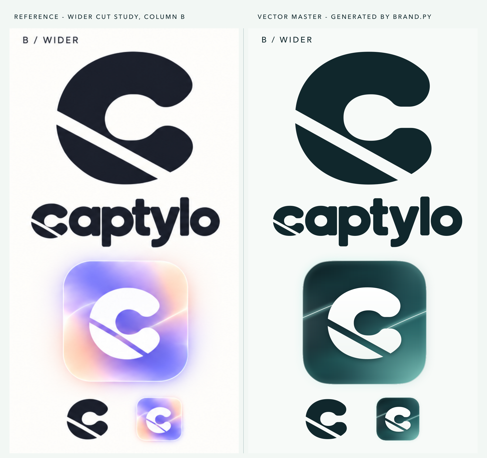

# Captylo - brand direction 01, variant B ("wider cut")

Vector master kit rebuilt from the owner's raster boards: `wordmark-board.png`, `brand-board.png` and `wider-cut-study.png` (column B is the chosen master). Everything in this folder except those three references is written by one script, `brand.py`, so nothing can drift.



`board.png` rebuilds the integrated wordmark board with these vectors (positive, glass, inverse, icon, symbol tiles, palette).

The kit is coloured in **Deep Tide** (the owner's board 04). The shapes are unchanged from the Iris version; only colour moved. The previous Iris kit is one flag away: `python3 brand.py --palette iris` (see Regenerate). The overview's left column is the owner's original raster study, so it stays in Iris.

## Files

| File | What it is |
|---|---|
| `symbol.svg`, `symbol-white.svg` | The C alone, Abyss / white, 1024 square canvas |
| `symbol-on-ink.svg`, `symbol-on-ivory.svg` | The C on a rounded tile (radius 120 on 1024), as on the board: white on Abyss, Abyss on Salt (file names kept from the Iris kit) |
| `wordmark.svg`, `wordmark-white.svg` | Outlined wordmark, transparent, Abyss / white. Design units: x-height 500, baseline y = 0 |
| `wordmark-inverse.svg` | White wordmark on an Abyss plate |
| `wordmark-glass.svg` | White wordmark in a clear, Glacier-tinted glass capsule over the Deep Tide field (website hero) |
| `icon.svg` | macOS app icon master, 1024 canvas, 824 body at (100, 100), continuous-corner squircle |
| `icon-32.svg`, `icon-16.svg` | Hinted small masters (used for the 16 and 32 px renditions) |
| `menubar.svg` | Template glyph, 18 x 18 pt, black on transparent |
| `menubar-recording.svg`, `menubar-recording-template.svg` | Recording state: the C plus a Record dot in the counter (colour / all-black template) |
| `png/` | Symbols 512 and 1024, wordmarks @2x and @4x, icon 16 to 1024, menu bar @1x and @2x |
| `AppIcon.appiconset/` | 10 PNGs (16 to 512@2x) + `Contents.json` (identical to `branding/AppIcon.appiconset/Contents.json`) |

## Construction

**The C** (`MARK` in `brand.py`, units of R = outer vertical radius). It is built only from exact primitives (superellipse arcs, circular arcs and lines) and fitted by least squares to the B symbol of the study. The fit reaches IoU 0.95 against the anti-aliased raster, and the same parameters also match the small B symbol and the C inside the B wordmark.
- Outer: superellipse, half-width 1.11, half-height 1, exponent 2.14 (a little fuller than an ellipse).
- Counter: soft superellipse 0.41 x 0.35 (exponent 2.15), a hair right of centre and above the middle.
- Mouth: horizontal slot, half-height 0.16. Terminals are cut at x = 0.86 and rounded with r = 0.31. A convex neck fillet (0.18) turns the counter into the underside of each terminal, which gives the "drop" shape.
- Cut: one straight, parallel gap, 0.178 R wide (8.9% of the height), 29 degrees below horizontal, with its centre line 0.515 R from the centre. It enters the left contour just below mid-height, passes under the counter's lower-left and leaves the bottom before the lower terminal.
- Small sizes widen the cut and the mouth so they survive: 32 px icon cut 0.22 R, menu bar 0.19 R. The 16 px icon drops the cut (at about 1 px it only muddies the C).

**Wordmark.** A custom rounded geometric construction, not a font. 35 OFL families were rendered side by side with the reference at their heaviest available weight (about 800): Manrope ExtraBold, Fredoka, Outfit, Nunito, Baloo 2, Urbanist, Sora, Lexend, Quicksand, Poppins, Gabarito, Rubik, Figtree, Jost, League Spartan, Montserrat Alternates and others. None matches: Manrope has a double-storey a and a straight y tail, and all of them are lighter than the reference. So the letters were measured on the boards (fitted like the C) and built from shared parts:
- Bowls (o, a, p): one superellipse ring, 538 x 516 with an overshoot of 8 and a counter of 218 x 196.
- Stems: 158 wide with 36 corner radii.
- t: a flat top, a crossbar and a foot with a 121 radius outer corner.
- y: two arms with a hooked tail, built as a ring sector.
- c: the symbol at the height of the bowls (1.032 x the x-height, overshoot included), centred on the x-height band, so its stroke matches the other letters.
- Spacing is as tight as the study, but every neighbouring pair keeps at least about 20 units of air (the study's l/o and t/y touch).
- Companion type from the board: Manrope (headings) and Inter (UI), both SIL OFL 1.1. The logo files contain outlines only, so no font is needed.

**App icon.**
- Shape: the macOS squircle from `branding/logo/icon.svg`.
- Plate: an 11 x 11 colour grid, drawn as an exact bilinear interpolation of vector gradients (no bitmap, no filter on the plate). In Deep Tide the grid is built by `water_grid` in `brand.py` (`TIDE_FIELD_GRID`): dark water lit from below right. Abyss holds the upper left and deepens into Petrol towards the lower right, where Glacier light blooms through the water over a deep glacier teal (`#2A8581`, which keeps the light clear instead of greying it). Faint Fog haze sits on the left edge and in the upper right, and a soft teal wave runs parallel to the streaks. The counter and the cut read as Petrol, so the white C keeps full contrast. The Iris grid (`IRIS_FIELD_GRID`) was sampled from the reference icon.
- 10% darker: the owner dimmed the background by 10% in the lab (a black overlay at 10%), so the Deep Tide plate and hero fields are multiplied by 0.9 (`TIDE_DIM`). Marks, streaks, rim and glow sit on top and are not dimmed.
- Details: two thin Glacier/Salt light streaks, a faint Glacier frosted inner edge, a Salt glass rim, and a soft Glacier outer glow.
- The C is white (fading to Salt at the bottom) at 58% of the body height, lifted by a soft Abyss shadow.
- All filters use `color-interpolation-filters="sRGB"`.
- Tahoe checks on the exported PNGs: every pixel inside the squircle is alpha 255 at every size, and the glow in the margin peaks at alpha 63 (unchanged from the Iris kit; the earlier Tahoe-verified kit had 58).

**Menu bar.**
- Template glyph, 16 pt tall on the 18 pt canvas, with the terminal ends on a whole point.
- Recording: ship the C as a template image and draw a Record dot (#F27878) in the counter on top. `menubar-recording.svg` shows the exact position and size. `menubar-recording-template.svg` is the all-black fallback.

## Palette

Deep Tide (current):

| Name | Hex | Role |
|---|---|---|
| Abyss | `#10272C` | Primary: symbol, wordmark, dark plates; deepest water on the icon |
| Petrol | `#214A52` | Body of the icon plate and the hero |
| Glacier | `#9FE6DC` | Light: blooms, streaks, outer glow, glass tint |
| Fog | `#B7CCCB` | Atmosphere: haze |
| Salt | `#F2F7F4` | Primary light surface; streak cores, rim |
| Record | `#F27878` | Recording state only |

The plate and hero fields are shown 10% darker than these values (see App icon).

Iris (previous, `--palette iris`): Ink `#202331`, Iris `#7165E8`, Mist `#C8C1F4`, Apricot `#F2B99F`, Ivory `#FAF9F6`, Record `#F06464`.

## Regenerate

```bash
pip install numpy skia-pathops     # geometry and booleans
brew install librsvg               # rsvg-convert, for the PNG exports
python3 brand.py                   # Deep Tide: all SVGs, png/, AppIcon.appiconset/, overview.png, board.png
python3 brand.py --svg-only        # SVGs only
python3 brand.py --palette iris    # the previous Iris kit (byte-identical to the last Iris export), same files
```

Both palettes write the same files, so the folder holds one palette at a time.

Change a shape by editing `MARK` (the C), `WM` (the letters and spacing) or `ICON_MARK_H`, and colour by editing `THEMES`, `TIDE_FIELD_GRID` / `TIDE_HERO_GRID` (the `water_grid` blooms and bands), `ICON_STYLE` and `HERO_STYLE`, then rerun.

## Known differences from the reference

- The reference C has a slight accidental tilt: its upper left is a little leaner and its lower left a little fuller, about 1% of R. The master keeps a clean vertical axis.
- The study's cut measures 0.178 R (about 9% of the height), not the 5% estimated from the description; the measurement wins.
- Letter spacing is opened a hair where the study letters touch. The wordmark is about 1.5% wider than the study.
- The study's C stands at 1.18 x the x-height, taller than the other letters. The owner found it too big (2026-09-27), so the C is aligned to the bowls of a, p and o; the word is correspondingly shorter at the front.
- The icon uses the macOS continuous-corner squircle rather than the board's plainer rounded square, and a gentler outer glow so macOS does not jail the icon.
